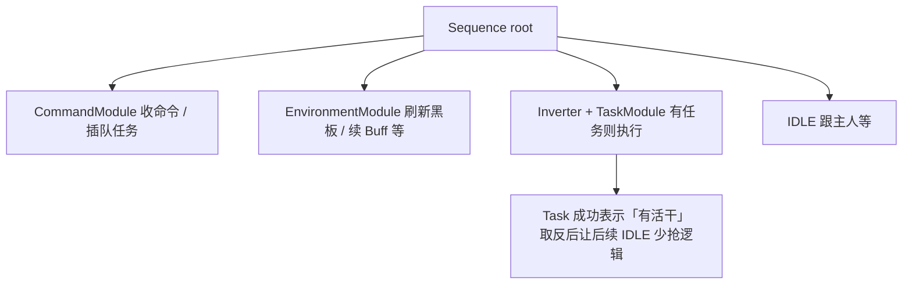

# Ragnarok 生命体 AI（Homunculus）

纯 Lua 生命体行为树，不依赖 AutoHotkey、地图数据或外控客户端。建议放到游戏客户端 `AI_sakray` 目录下使用：

1. 进入游戏客户端下的 `AI_sakray` 目录。
2. **先删掉该目录里原有的其它文件**（如有需要请自行备份）。
3. 将 [boziAI](https://github.com/ranmeizi/boziAI.git) 仓库内容克隆到当前目录（`.` 即 `AI_sakray`）：

```bash
cd <游戏客户端路径>/AI_sakray
# 清空目录（示例；请按需备份后再执行）
rm -rf ./*
git clone https://github.com/ranmeizi/boziAI.git .
```

## 目录速览

| 路径 | 说明 |
|------|------|
| `USER_AI/AI.lua` | 入口：全局黑板、按生命体类型选行为树 |
| `USER_AI/Const.lua` | 常量（技能 id、命令类型、节点状态等） |
| `USER_AI/Util.lua` | `TryJumpTask` 等工具函数 |
| `USER_AI/Memory.lua` | 任务记忆持久化（`memory.json`） |
| `USER_AI/HOMU/` | 各系行为树（`Filir` / `Lif` / `Amistr` / `Vanilmirth`）、`kill/` 战斗策略 |
| `USER_AI/BehaviorTree/common/subtrees/` | 命令 / 环境 / 任务分发子树 |
| `USER_AI/BehaviorTree/common/task/` | 各 Task 子树（Farm、Kill、Drain…） |
| `USER_AI/BehaviorTree/Core/` | 行为树基础节点与装饰器 |
| `USER_AI/types/dev.lua` | LuaLS 任务类型注解 |
| `USER_AI/tatget_blacklist_conf.lua` | 自动寻敌类型黑名单（`V_HOMUNTYPE`） |
| `USER_AI/tatget_whitelist_conf.lua` | 自动寻敌类型白名单（有配置项才启用，否则正常寻敌） |

---

## 本地测试

在仓库根目录（`AI_sakray/`）执行，需本机已安装 [pnpm](https://pnpm.io/) 与 `lua`：

```bash
cd AI_sakray
pnpm run test
```

| 命令 | 说明 |
|------|------|
| `pnpm run test:readjson` / `test:memory` / `test:try` / `test:loop` / `test:bt` | 各 USER_AI 测试 |
| `pnpm run test` | 跑完全部 |

脚本通过 `scripts/run-lua-test.mjs` 自动 `cd` 到仓库**上级**再调 `lua`（与客户端 `AI_sakray/...` 路径一致）。

---

## 行为树设计

### 跨 Tick 的 Task

同一时刻**只执行一个**当前任务：`Blackboard.task`；其余排队在 `Blackboard.task_queue`（`Array`）。

需要「插队」时用 `TryJumpTask(task, options)`（`USER_AI/Util.lua`）：把当前任务 `unshift` 回队列，再挂上 `task`；可选 `removeUniqueTask` 去掉队列里同名任务。

具体子行为由各 `BehaviorTree/common/task/*.lua` 定义；**Kill、MoveTo、UseSkill** 等用 `Task:new(...)` 包一层 **TaskNode**：子节点返回非 `RUNNING` 时结束当前任务并从队列 `shift` 下一个。

### Core

`BehaviorTree/Core/`：`Sequence` / `Selector`、`Task`、`Timeout`、`Inverter`、`RunningOrNot`、`ActionNode`、`ConditionNode` 等。

### Filir 主树（当前默认）

根在 `HOMU/Filir_behavior.lua`：



执行顺序每帧：**命令 → 环境 → 任务 → 空闲**。

---

## 命令系统（CommandModule）

客户端消息由 `ResCommand` 写入 `Blackboard.cmds`（`Array`），`CommandModule` 消费。

### Alt+T 组合

- **第一条 + 第二条均为 FOLLOW_CMD**：清空 `cmds`、清空 `task` 与 `task_queue`（放弃所有任务）。
- **第一条 FOLLOW + 第二条 MOVE**：把 Move 的 **目标格** 与主人周围 **8 邻格**比对，命中则触发对应 **Option 1～8**；之后 `cmds` 整理成单条 FOLLOW 并带 `Timeout`，超时清空命令。

### 主人周围 8 格 → Option 编号

相对主人 `(dx, dy)` → option（与代码 `getValidOptions` 一致）：

| option | 相对格 |
|--------|--------|
| 1 | 左上 (-1,1) |
| 2 | 上 (0,1) |
| 3 | 右上 (1,1) |
| 4 | 左 (-1,0) |
| 5 | 右 (1,0) |
| 6 | 左下 (-1,-1) |
| 7 | 下 (0,-1) |
| 8 | 右下 (1,-1) |

### 各 Option 行为（实现见 `CommandModule.lua`）

| Option | 行为 |
|--------|------|
| 1 | `TryJumpTask(Farm)` — madDog 寻敌，有怪 Kill、无怪跟主人 |
| 2 | 开关 `Blackboard.buff_conf`（飞里乐 Fleet/Speed 等，由 `EnvironmentModule` 续） |
| 3 | `TryJumpTask(Drain)` — 大队 / 月光点名循环 |
| 4 | 预留（无操作） |
| 5 | `TryJumpTask(RoundRect)` — 绕目标 8 格环 |
| 6 | `TryJumpTask(RoundRandom)` — 目标周围 3 格内随机跳 |
| 7 | `TryJumpTask(Grind)` — loyalDog 挂机，无怪只跟主人 |
| 8 | `TryJumpTask(Solve2048)` |

### 其它直连命令（不走 8 格菜单）

- **MOVE_CMD**：插队 `MoveTo`（`TryJumpTask`，`removeUniqueTask`）。
- **ATTACT_OBJET_CMD**：插队 `Kill`。
- **SKILL_OBJECT_CMD**：当场 `UseSkill`（不经过 Task 表）。

---

## 任务模块（TaskModule）

`TaskModule.lua` 根据 `Blackboard.task.name` 分发：

| name | 文件 | 简述 |
|------|------|------|
| `MoveTo` | `task/MoveTo.lua` | 走到坐标或目标 |
| `Kill` | `task/Kill.lua` | 接近并击杀 |
| `Stop` | `task/Stop.lua` | 保持在屏内等 |
| `Farm` | `task/Farm.lua` | madDog 寻敌 → Kill；无怪跟主人 |
| `Grind` | `task/Grind.lua` | loyalDog 寻敌 → Kill；无怪跟主人 |
| `Drain` | `task/Drain.lua` | 筛选特殊怪 → Touch 循环 |
| `Touch` | `task/Touch.lua` | 对单怪月光 + `Drain.touchRegistry` |
| `UseSkill` | `task/UseSkill.lua` | 单次技能 |
| `Solve2048` | `task/Solve2048.lua` | 小游戏实验 |
| `RoundRect` / `RoundRandom` | `task/Funny/*.lua` | 绕圈演示 |

另有 `Testing_behavior.lua` 供实验；线上默认 `FilirBT`（`AI.lua`）。

---

## Farm / Grind / Drain（对照）

| 模式 | Option | 寻敌 | 有怪 | 无怪 |
|------|--------|------|------|------|
| **Farm** | 1 | madDog（优先主人正在打的怪） | `Kill` | `MoveToOwner` |
| **Grind** | 7 | loyalDog（主人/友方/仇恨/最近） | `Kill` | 仅 `MoveToOwner` |
| **Drain** | 3 | 月光射程内特殊怪 | `Touch` | — |

结束 **Farm / Grind / Drain**：**双 Alt+T**（两条 FOLLOW）清任务队列。

---

若文档与代码不一致，以 `USER_AI` 下 Lua 为准。
